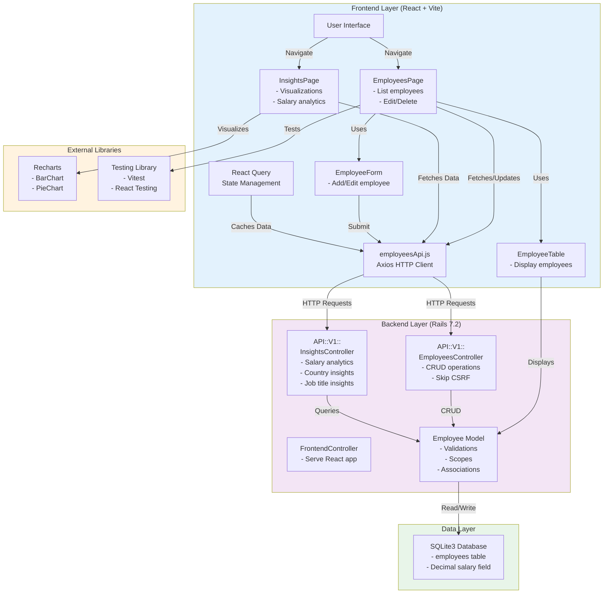

# Salary Management Application Architecture

## System Overview

This document describes the architecture of the Salary Management application, a full-stack web application for managing employee salary data and generating insights.

## Architecture Diagram



## Technology Stack

### Frontend
- **React 18**: UI library
- **Vite**: Build tool and dev server
- **React Query (@tanstack/react-query)**: Data fetching and caching
- **Axios**: HTTP client
- **Recharts**: Data visualization library
- **Vitest**: Unit testing framework
- **React Testing Library**: Component testing

### Backend
- **Ruby on Rails 7.2**: Web framework
- **Ruby 3.1.2**: Programming language
- **Puma 8.0**: Web server
- **SQLite3**: Database
- **Kaminari**: Pagination

### Build & Deployment
- **Vite Ruby**: Rails integration for Vite
- **Docker**: Containerization

## Layer Descriptions

### 1. Frontend Layer (React + Vite)

#### Pages
- **EmployeesPage**: Main page for employee management
  - Lists employees with pagination
  - Search and filter capabilities
  - Add, edit, and delete operations
  
- **InsightsPage**: Analytics and reporting dashboard
  - Summary KPI cards (Total Employees, Active, Avg Salary, Recent Hires)
  - Charts:
    - Employees by Department (Pie Chart)
    - Salary Distribution (Bar Chart)
    - Top Paying Countries (Horizontal Bar Chart with multi-color)
  - Drill-down analysis by country and job title

#### Components
- **EmployeeForm**: Reusable form for creating/editing employees
  - Salary field: Text input to prevent browser number precision issues
  - All required validations
  
- **EmployeeTable**: Displays employee list with actions
  - Sortable columns
  - Edit/Delete buttons
  - Displays salary in ₹ (Indian Rupees)

#### API Layer
- **employeesApi.js**: Axios instance with base URL `/api/v1`
  - `getEmployees()`: Fetch employee list with filters
  - `createEmployee()`: Create new employee
  - `updateEmployee()`: Update employee data
  - `deleteEmployee()`: Delete employee
  - `getSummary()`: Get dashboard statistics
  - `getInsightsByCountry()`: Country-specific salary insights
  - `getInsightsByJobTitle()`: Job title salary insights
  - `getFilters()`: Available countries and job titles

#### State Management
- **React Query**: Handles server state with automatic caching
  - Automatic refetching
  - Query invalidation on mutations
  - Optimistic updates

### 2. Backend Layer (Rails 7.2)

#### Controllers
- **FrontendController**: Serves the React SPA
  - Single route: GET `/` renders the React app

- **API::V1::EmployeesController**
  - `index`: List employees with pagination, search, filters
  - `create`: Create new employee
  - `show`: Get single employee
  - `update`: Update employee
  - `destroy`: Delete employee
  - CSRF protection disabled for API endpoints

- **API::V1::InsightsController**
  - `summary`: Dashboard statistics
    - Total employees
    - Active employees
    - Average salary
    - Recent hires (90 days)
    - Department breakdown
    - Salary bands distribution
    - Top paying countries
  - `by_country`: Country-specific insights
    - Headcount
    - Min, avg, max salary
  - `by_job_title`: Job title insights
    - Salary range by country
  - `filters`: Available filter options

#### Models
- **Employee**
  - Attributes:
    - `full_name`: string (required)
    - `job_title`: string (required)
    - `department`: string (required)
    - `country`: string (required)
    - `email`: string (required, unique, lowercase)
    - `salary`: decimal (required, > 0)
    - `employment_type`: string (full_time, part_time, contract)
    - `hired_on`: date
    - `active`: boolean
  - Validations:
    - Presence checks for required fields
    - Email uniqueness
    - Salary numericality
    - Employment type inclusion
  - Scopes:
    - `by_country(country)`: Filter by country
    - `by_job_title(job_title)`: Filter by job title
    - `active`: Filter active employees
  - Associations: Pagination via Kaminari

### 3. Data Layer

#### Database Schema
```sql
CREATE TABLE employees (
  id INTEGER PRIMARY KEY,
  full_name VARCHAR,
  job_title VARCHAR,
  department VARCHAR,
  country VARCHAR,
  email VARCHAR UNIQUE,
  salary DECIMAL,
  employment_type VARCHAR,
  hired_on DATE,
  active BOOLEAN,
  created_at DATETIME,
  updated_at DATETIME
);
```

**Key Features:**
- Salary stored as DECIMAL for precision (avoids floating-point errors)
- SQLite3 with WAL mode disabled (DELETE mode for compatibility)
- Automatic timestamps

## API Endpoints

### Employee Management
```
GET    /api/v1/employees                  List employees (paginated, searchable)
POST   /api/v1/employees                  Create employee
GET    /api/v1/employees/:id              Get single employee
PUT    /api/v1/employees/:id              Update employee
DELETE /api/v1/employees/:id              Delete employee
```

### Insights & Analytics
```
GET    /api/v1/insights/summary           Dashboard statistics
GET    /api/v1/insights/by_country        Country salary insights
GET    /api/v1/insights/by_job_title      Job title salary analysis
GET    /api/v1/insights/filters           Available filter options
```

## Data Flow

### Creating/Updating an Employee
1. User fills form in React (EmployeeForm)
2. Form submission sends data via Axios to `/api/v1/employees`
3. Server validates employee data
4. Employee saved to SQLite database
5. React Query invalidates cache
6. Frontend queries are automatically refetched
7. UI updates with new/updated employee

### Viewing Insights
1. InsightsPage mounts and triggers React Query
2. Queries fetch: summary, filters, and optional drill-down data
3. Data received from API and cached by React Query
4. Recharts components render visualizations
5. User selects country/job title for drill-down
6. Conditional queries fetch detailed insights
7. KPI cards and charts update

## Key Design Decisions

### 1. Salary Precision
- **Problem**: JavaScript number precision issues with large salary values
- **Solution**: Store salary as decimal in database, send as strings in API
- **Frontend handling**: Salary input field is text type instead of number

### 2. CSRF Protection
- Frontend is same-origin, so included in CSRF protection
- API endpoints skip CSRF (`skip_before_action :verify_authenticity_token`)
- Proper for external API clients

### 3. Multi-color Charts
- Top Paying Countries uses color cycle for visual distinction
- Department pie chart uses color palette
- Makes it easy to identify different segments

### 4. Currency Display
- All salaries display in ₹ (Indian Rupees)
- Consistent across tables and charts
- Locale-aware number formatting

### 5. React Query for State
- Automatic caching prevents unnecessary API calls
- Optimistic updates improve UX
- Background refetching keeps data fresh

## File Structure

```
salary_management/
├── app/
│   ├── controllers/
│   │   ├── application_controller.rb
│   │   ├── frontend_controller.rb
│   │   └── api/v1/
│   │       ├── employees_controller.rb
│   │       └── insights_controller.rb
│   ├── frontend/
│   │   ├── api/
│   │   │   └── employeesApi.js
│   │   ├── pages/
│   │   │   ├── EmployeesPage.jsx
│   │   │   └── InsightsPage.jsx
│   │   ├── components/
│   │   │   ├── EmployeeForm.jsx
│   │   │   └── EmployeeTable.jsx
│   │   └── App.jsx
│   ├── models/
│   │   └── employee.rb
│   └── views/
│       └── layouts/application.html.erb
├── config/
│   ├── routes.rb
│   └── vite.json
├── db/
│   ├── schema.rb
│   └── migrate/
└── spec/ & test/
    └── [test files]
```

## Performance Considerations

- **Pagination**: Employees list uses Kaminari for pagination (25 per page)
- **Caching**: React Query caches all API responses
- **Debouncing**: Search input debounced server-side
- **Lazy Loading**: Drill-down queries only fetch when needed

## Security Features

- Password-less API (suitable for internal tools)
- CSRF protection on main app
- Email validation and uniqueness
- Input validation on both client and server
- Proper error handling and validation messages

## Future Enhancements

- Authentication & authorization
- Bulk import/export
- Advanced filtering and sorting
- Audit logging
- Performance optimizations
- Mobile app support
- Real-time updates with WebSockets
